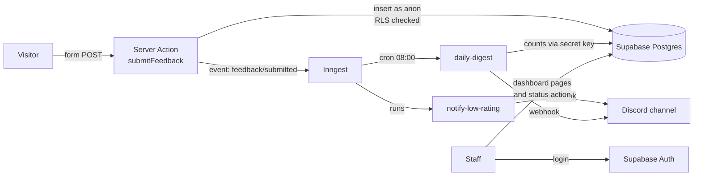

# Feedback Inbox

A small, production-style feedback system for aged-care providers: residents and families leave
feedback, low ratings alert the team on Discord straight away, and staff triage everything from a
dashboard.

**Live demo:** https://feedback-inbox-rho.vercel.app · **Demo staff login:** `staff@feedback-inbox.test`
/ `inbox-demo-2026`

It's a slice of the kind of product I work on day to day, rebuilt in **Next.js 16, TypeScript,
Supabase, Tailwind and Inngest**.

## Features

- **Public feedback form**: 1–5 rating, category and message, with optional name and email. Server-side
  validation with Zod, accessible errors, and no full page reload.
- **Staff login** with Supabase Auth (email and password).
- **Dashboard**: open/new/negative counts, filtering by status and category, a detail page, and
  status changes (new → in progress → resolved).
- **Instant Discord alert** for ratings of 1–2, sent from a background job with automatic retries.
- **Daily digest** posted to Discord at 8:00 Manila time by a scheduled job.

## Architecture



### Key decisions

| Decision | Why |
|---|---|
| **Row Level Security** on `feedback` | Security lives in the database: logged-out visitors can only insert fresh, unresolved rows, and only logged-in staff can read or update. It holds even if someone calls the API directly. |
| **Server Actions** for every write | Plain POST endpoints that run on the server, so each one validates input with Zod and checks the user itself instead of trusting the page. |
| **Two Supabase clients** | The normal client acts as the current user, so RLS applies. The admin client (secret key) is only used in background jobs, and its `server-only` import makes the build fail if browser code ever imports it. |
| **Inngest** for background work | Discord being slow or down never slows or breaks the form. Failed steps retry on their own, and the cron schedule lives in code. |
| **The app generates the UUID** for new feedback | RLS doesn't let anonymous visitors read rows back, so the id is created before the insert and passed to the alert job. |
| **Pure message formatters** (`lib/discord.ts`) | The Discord payloads are unit-tested without network calls. Mentions are disabled, so user text can't ping `@everyone`. |

## Tech stack

Next.js 16 (App Router, Server Actions, `proxy.ts`) · React 19 · TypeScript · Tailwind CSS 4 ·
Supabase (Postgres, Auth, RLS, CLI migrations) · Inngest · Zod · Vitest · GitHub Actions

## Running it locally

Requirements: Node 22 (pinned in `mise.toml`) and Docker.

```bash
npm install
cp .env.example .env.local        # then paste the keys printed by the next command
npx supabase start                # local Postgres, Auth and Studio in Docker
npx supabase db reset             # runs migrations and loads seed data, including the demo login
npm run dev                       # http://localhost:3000
npm run inngest:dev               # in a second terminal: Inngest dev UI at http://localhost:8288
```

Without `DISCORD_WEBHOOK_URL`, alerts are printed to the terminal instead of being sent.

| Command | What it does |
|---|---|
| `npm test` | Unit tests (Vitest) |
| `npm run lint` | ESLint |
| `npm run typecheck` | TypeScript, including Next.js route types |
| `npm run db:types` | Regenerate `lib/database.types.ts` from the local schema |

CI runs lint, type-check, tests and a production build on every push.

## Project structure

```
app/
  page.tsx, feedback-form.tsx    public form (Server Component + Client Component)
  login/                         staff login
  dashboard/                     list, filters, detail page, status changes
  api/inngest/route.ts           endpoint Inngest calls to run the jobs
lib/
  feedback.ts                    categories, statuses and Zod schemas
  actions/                       Server Actions (feedback, auth, dashboard)
  supabase/                      server and admin clients
  inngest/                       client and functions (alert and digest)
  discord.ts                     webhook payloads and sender
proxy.ts                         refreshes the login session and guards /dashboard
supabase/migrations/             SQL migrations, including RLS policies
supabase/seed.sql                demo staff account and sample feedback
```

## How it was built

Built with Claude Code as a pair programmer. The steps, the reasoning behind each one, and the
commands to rebuild it from scratch are in [`docs/BUILD_NOTES.md`](docs/BUILD_NOTES.md).
